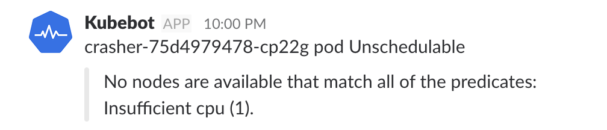

# Kube Monitor Slackbot

KubeMonitor is a monitoring slackbot for Kubernetes clusters. It informs about failing pods in the cluster in realtime and helps to troubleshot them.

## Getting Started

## Requirements
- Kubernetes 1.7+

## Documentation
- [Manual Installation](docs/ManualInstallation.md)
- [Docker Hub](https://hub.docker.com/r/no0dles/kubemonitor-slackbot/)

## License

WTFPL